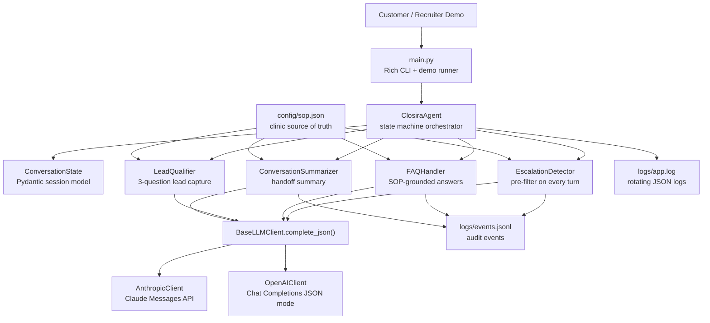
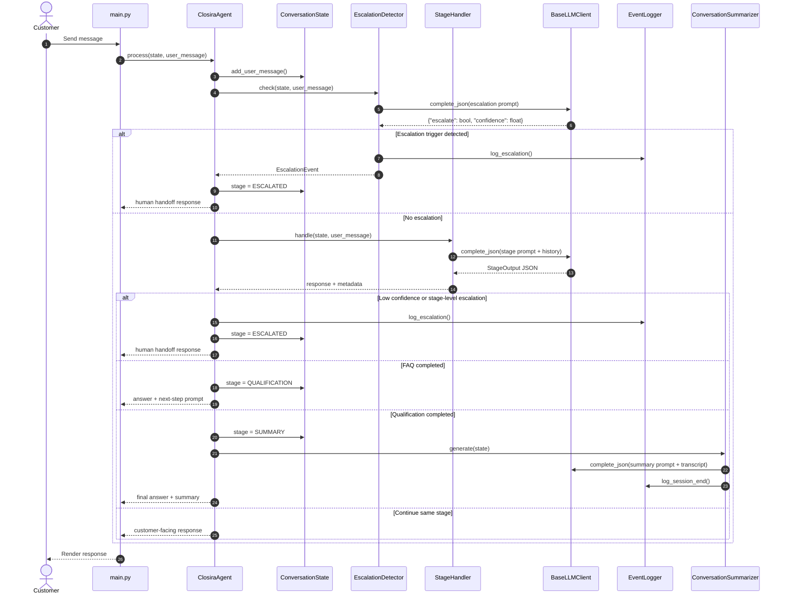
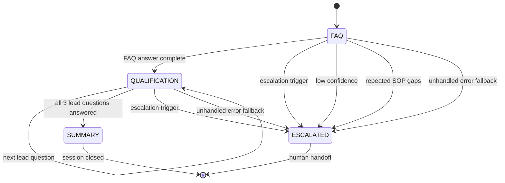
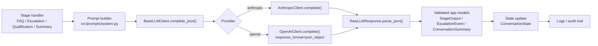

# Closira AI Agent

AI customer-support workflow for **Bloom Aesthetics Clinic**, built as a focused AI Engineering project for Closira.

The agent answers SOP-grounded customer questions, qualifies high-intent leads, detects escalation triggers, and produces a structured end-of-session summary for clinic staff.

## Recruiter Snapshot

| Area | What this project demonstrates |
|---|---|
| AI workflow design | Multi-stage agent pipeline with explicit state transitions, deterministic routing, and stage-specific prompts |
| LLM integration | Provider-agnostic Anthropic/OpenAI client with structured JSON responses |
| Safety and reliability | Dedicated escalation pre-filter, SOP-bound answers, low-confidence handling, and audit logs |
| Backend engineering | Typed Pydantic state models, modular stage handlers, no global conversation state |
| Product thinking | Clinic-ready CLI demo, lead qualification flow, and clear handoff summaries for human coordinators |

## What It Does

- Answers customer FAQs using only `config/sop.json`.
- Routes every active message through an escalation classifier before normal handling.
- Qualifies interested customers with three structured lead questions.
- Escalates complaints, medical questions, pricing negotiation, safety concerns, human requests, repeated SOP gaps, and low-confidence responses.
- Generates a final `ConversationSummary` with intent, lead details, SOP gaps, escalation context, and recommended next action.
- Supports Anthropic Claude and OpenAI GPT through the same `BaseLLMClient` interface.

## Architecture



## Per-Turn Processing Pipeline



## State Machine



## Structured LLM Call Pipeline

The project does not depend on provider-specific native tool calling. Instead, each stage uses a **function-call-style JSON contract**: the prompt defines the exact schema, the provider client returns JSON text, `RawLLMResponse.parse_json()` extracts a valid object, and the stage converts it into typed application state.



### Core JSON Contract

Every stage response follows the same predictable shape, which keeps parsing and routing simple:

```json
{
  "response": "customer-facing message",
  "confidence": 0.95,
  "escalate": false,
  "escalation_reason": null,
  "escalation_type": null,
  "stage_complete": false,
  "sop_gap_detected": false,
  "sop_gap_description": null,
  "extracted_data": {}
}
```

## Project Structure

```text
closira-ai-agent/
|-- main.py                     # CLI entry point: interactive and demo modes
|-- requirements.txt
|-- .env.example
|-- prompt_design.md            # Prompt strategy, trade-offs, and rationale
|-- config/
|   `-- sop.json                # Bloom Aesthetics Clinic SOP
|-- src/
|   |-- agent.py                # Orchestrator and state-machine routing
|   |-- models/
|   |   `-- schemas.py          # Pydantic models for state, events, summaries
|   |-- prompts/
|   |   `-- system.py           # Prompt builders and JSON output contracts
|   |-- stages/
|   |   |-- escalation.py       # Dedicated escalation classifier
|   |   |-- faq.py              # SOP-grounded FAQ answering
|   |   |-- qualifier.py        # Lead qualification flow
|   |   `-- summarizer.py       # Final conversation summary
|   `-- utils/
|       |-- llm_client.py       # Anthropic/OpenAI abstraction
|       `-- logger.py           # Structured app and audit logging
`-- test_transcripts/
    |-- 01_in_sop_question.md
    |-- 02_out_of_scope.md
    |-- 03_escalation_trigger.md
    |-- 04_lead_qualification.md
    `-- 05_conversation_summary.md
```

## Key Engineering Decisions

| Decision | Why it matters |
|---|---|
| Stage-specific prompts | Each task stays narrow: answering, qualifying, escalating, or summarizing. This makes behavior easier to test and improve. |
| Escalation pre-filter | Safety-sensitive messages are checked before normal routing, so a stage prompt cannot accidentally continue the conversation when handoff is required. |
| Structured JSON outputs | LLM responses become predictable program inputs instead of brittle free text. |
| Provider abstraction | Anthropic and OpenAI can be swapped with `--provider` while the rest of the agent stays unchanged. |
| Pydantic state model | `ConversationState` is serializable, validated, and passed through every handler without hidden global state. |
| Audit logging | Escalations, SOP gaps, and session end events are written as JSONL for review and operations visibility. |

## Setup

### Prerequisites

- Python 3.10+
- An Anthropic API key or an OpenAI API key

### Installation

```bash
git clone https://github.com/Nihal108-bi/closira-ai-agent.git
cd closira-ai-agent

python -m venv .venv
source .venv/bin/activate   # Windows: .venv\Scripts\activate

pip install -r requirements.txt

cp .env.example .env
# Add ANTHROPIC_API_KEY or OPENAI_API_KEY to .env
```

## Running the Agent

### Interactive Mode

```bash
python main.py
```

Useful options:

```bash
python main.py --provider openai
python main.py --model claude-3-5-sonnet-20241022
python main.py --debug
```

In-session commands:

| Command | Behavior |
|---|---|
| `/summary` | Generate a summary of the current session |
| `/quit` | End the session |

### Demo Mode

```bash
python main.py --demo
```

Demo mode runs five prebuilt scenarios:

1. In-SOP question
2. Out-of-scope question
3. Escalation trigger
4. Lead qualification
5. Full session with summary

## SOP Grounding

The agent's source of truth is `config/sop.json`. It includes:

- Business name, location, hours, and booking channels
- Botox, dermal fillers, and consultation details
- Prices, treatment durations, expected results, and aftercare notes
- Cancellation and rescheduling policy
- Escalation trigger definitions
- Frequently asked questions

To adapt the agent for another business:

1. Replace `config/sop.json`.
2. Update the qualification questions in `src/prompts/system.py`.
3. Keep the orchestration code unchanged unless the workflow itself changes.

## Escalation Rules

| Trigger | Example |
|---|---|
| Negative sentiment or complaint | "I'm really unhappy with my last treatment." |
| Medical question | "Can I have Botox while taking medication?" |
| Pricing negotiation | "Can you do fillers cheaper?" |
| Explicit human request | "I want to speak to a real person." |
| Safety concern | "My face is swollen after treatment." |
| Repeated SOP gaps | More than two consecutive questions not covered by the SOP |
| Low model confidence | Confidence below 50 percent after stage processing |

When a trigger fires, the agent moves to `ESCALATED`, returns the human handoff message, and records the event in `logs/events.jsonl`.

## Logging and Observability

| File | Purpose |
|---|---|
| `logs/app.log` | Rotating JSON application logs |
| `logs/events.jsonl` | Audit log for escalations, SOP gaps, and session end events |

Example audit event shape:

```json
{
  "ts": "2026-05-23T00:00:00Z",
  "event_type": "ESCALATION",
  "session_id": "abc12345",
  "trigger_type": "medical_question",
  "reason": "Customer asked for medical suitability advice.",
  "confidence": 0.94,
  "flagged_message": "Can I have Botox while pregnant?"
}
```

## Evaluation Coverage

| Requirement | Implementation evidence |
|---|---|
| In-SOP answering | `FAQHandler` grounds answers in `config/sop.json`; transcript `01_in_sop_question.md` |
| Out-of-scope handling | SOP gap tracking and repeated-gap escalation; transcript `02_out_of_scope.md` |
| Escalation trigger | Dedicated classifier in `src/stages/escalation.py`; transcript `03_escalation_trigger.md` |
| Lead qualification | `LeadQualifier` stores answers in `ConversationState.lead_data`; transcript `04_lead_qualification.md` |
| Conversation summary | `ConversationSummarizer` returns `ConversationSummary`; transcript `05_conversation_summary.md` |
| Prompt reasoning | `prompt_design.md` documents prompt strategy and trade-offs |

## Trade-offs and Production Improvements

| Current choice | Benefit | Production upgrade |
|---|---|---|
| Escalation LLM call on every turn | Clear safety boundary | Add deterministic rules for obvious triggers, then use LLM for ambiguous cases |
| In-memory state | Simple local demo | Persist `ConversationState` in Redis or Postgres |
| SOP injected into prompts | Works well for small SOPs | Use retrieval with source citations for larger knowledge bases |
| No streaming | Simpler CLI behavior | Stream responses for WhatsApp or web chat UX |
| English-only prompts and SOP | Focused assignment scope | Add language detection and localized SOP content |

## Quick Interview Talking Points

- I separated orchestration from stage behavior so each stage can be tested and improved independently.
- I used structured JSON contracts to make LLM output behave like typed function returns.
- I added a dedicated escalation classifier before normal response generation to reduce safety misses.
- I kept state explicit and serializable, which makes the design ready for future persistence or multi-channel deployment.
- I included audit logs so human operators can review why the AI escalated or where the SOP had gaps.
